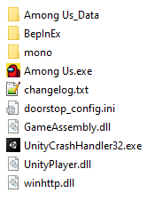

# HideGameCode

Among Us mod that hides the game code and copy it to clipboard

## Features

-   Hide game code in lobby
-   Hide game code when in the menu
-   Automatically copied to clipboard on join, ability to copy again by clicking on the Public/Private button
-   Game code placeholder and color are customizable

## Customize

-   Edit the fields in `AmongUs/BepInEx/Config/com.herysia.hidegamecode.cfg` using notepad and restart among us

## Technical stuff
-   Support Among us v2021.5.10s (Steam only)

### Installation

All players should have the mod install for the best user experience

-   Download the [lastest release](https://github.com/Herysia/HideGameCode/releases/latest).
-   Extract the files into Among us game folder (`steam/steamapps/common/Among us`)
-   This should look like this
    
-   **Run the game from steam**

### Installation side note

If you want to install Reactor by yourself, please follow the [BepInEx](https://docs.reactor.gg/docs/basic/install_bepinex) installation instruction.

### Uninstall

If you want to uninstall this mod only, remove the dll `Among Us/BepInEx/plugins/HideGameCode.dll`.

If you want to disable it, you can temporarily rename or remove the file `Among Us/winhttp.dll`

If you want to completely uninstall Reactor/BepInEx, remove the following files and folders

```
+-- BepInEx
+-- mono
+-- changelog.txt
+-- doorstop_config.ini
+-- winhttp.dll
```

# Contributing

You have encountered a bug or unexpected behaviour ? You want to suggest or add a new feature ? Create an [Issue](https://github.com/Herysia/HideGameCode/issues) or [PR](https://github.com/Herysia/HideGameCode/pulls) !

### Creating PR

-   [Fork this on github](https://github.com/Herysia/HideGameCode/fork)
-   Clone your repo, commit and push your changes
-   Request a new Pull request

# Licensing & Credits

HideGameCode is licensed under the MIT License. See [LICENSE](LICENSE.md) for the full License.

Third-party libraries:

-   [BepInEx (Reactor fork)](https://github.com/NuclearPowered/BepInEx) is licensed under the LGPL 2.1 License. See [LICENSE](https://github.com/NuclearPowered/BepInEx/blob/master/LICENSE) for the full License.
-   Unity Runtime libraries are part of Unity Software.  
    Their usage is subject to [Unity Terms of Service](https://unity3d.com/legal/terms-of-service), including [Unity Software Additional Terms](https://unity3d.com/legal/terms-of-service/software).

# Contact

### Discord: Herysia#4293
